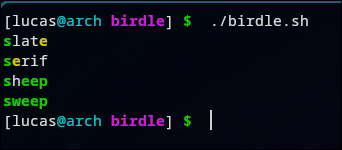

# birdle
A simple clone(ish) of Wordle in a bash script. To run, `chmod +x` the file `birdle.sh`. 

If you want to be able to play it from anywhere, you can add it as an alias to your `.bashrc`, but you'll need to change the relative file paths for `./.birdle/guesses` and `./.birdle/targets` to absolute ones.

## Demo

